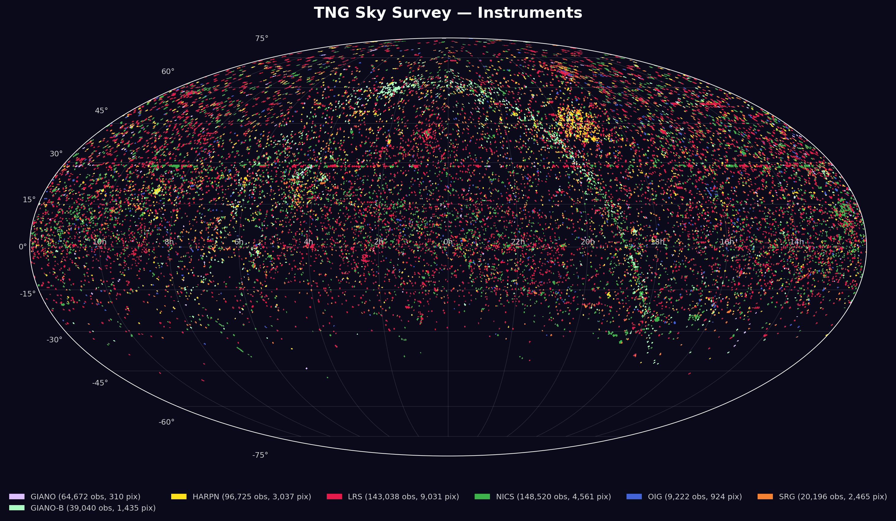

# TNG Sky Map

A HEALPix sky map of **26 years of observations** from the [Telescopio Nazionale Galileo (TNG)](https://www.tng.iac.es/) at Roque de los Muchachos Observatory, La Palma.

Each pixel is colored by the **dominant instrument** used to observe that region of the sky, revealing the telescope's scientific history across seven instruments and over half a million exposures.



## Quick start

```bash
git clone https://github.com/josesj/tng-sky-map.git
cd tng-sky-map
uv venv && uv pip install -e .
uv run tng-sky-map
```

The first run downloads ~784k unique exposures from the IA2 Virtual Observatory (takes a few minutes). Subsequent runs use the local SQLite cache.

## Usage

```bash
tng-sky-map                         # Generate sky_instruments.png
tng-sky-map -o map.png              # Custom output path
tng-sky-map --svg                   # SVG output
tng-sky-map --refresh               # Re-download data from VO
```

## What it does

1. **Downloads** all SCIENCE/OBJECT observations from the [IA2 Virtual Observatory](http://archives.ia2.inaf.it/vo/tap/tng) TAP service (year by year to avoid timeouts)
2. **Deduplicates** multi-file exposures (HARPS-N generates ~20 VO rows per exposure, GIANO ~3)
3. **Filters** calibrations, test programs, solar observations, drift scans, parking positions, default coordinates, and observations below the telescope's elevation limit
4. **Projects** observations onto a [HEALPix](https://healpix.jpl.nasa.gov/) equal-area grid (NSIDE=128, ~27.5 arcmin resolution)
5. **Renders** a Mollweide projection colored by the dominant instrument at each pixel

## Data source

All data comes from the **IA2 Virtual Observatory** TAP service at `archives.ia2.inaf.it`, which hosts the complete TNG observation archive from 2000 to present. No local database or credentials are required.

The data is cached locally in `cache/observations.db` (SQLite, ~30 MB) after the first download.

## Instruments

| Color                                                    | Instrument | Type                                          | Active    |
| -------------------------------------------------------- | ---------- | --------------------------------------------- | --------- |
|  | LRS        | Low Resolution Spectrograph                   | 2000–     |
|  | NICS       | Near Infrared Camera/Spectrometer             | 2003–     |
|  | HARPN      | High Accuracy Radial velocity Planet Searcher | 2012–     |
|  | GIANO      | High Resolution IR Spectrograph               | 2015–2016 |
|  | GIANO-B    | High Resolution IR Spectrograph (upgraded)    | 2017–     |
|  | SRG/SARG   | Echelle Spectrograph                          | 2000–2012 |
|  | OIG        | Optical Imager Galileo                        | 2000–2007 |

## Filters applied

| Filter                                      | Records removed |
| ------------------------------------------- | --------------- |
| Excluded programs (CALIB, TEST, NULL, etc.) | ~55k            |
| Solar observations (SOLAR, GIANO-SOLAR)     | ~203k           |
| Below elevation limit (DEC < -49.2°)        | ~560            |
| Default coordinates (RA~0°, DEC~0°)         | ~340            |
| Drift scans (constant DEC, varying RA)      | ~2.8k           |
| Zenith parking (NONE at DEC ~28.8°)         | ~1.8k           |
| Exposure time cap (>7200s capped)           | 3               |
| VO deduplication (HARPS-N/GIANO)            | ~5.5M           |

## Key findings

- **8.9% sky coverage** — the TNG is a pointed telescope, not a survey instrument
- **521k unique exposures** across 7,656 observing nights
- **37,420 hours** total exposure time (4.3 years of continuous shutter time)
- **HARPS-N** dominates the exposure time (55%) despite having fewer exposures than LRS or NICS — its typical exposure is 15 minutes vs 30 seconds for imaging
- The map clearly shows the transition from a general-purpose telescope (2000–2012) to an exoplanet-focused facility (2013–present)

## Requirements

- Python >= 3.10
- [uv](https://docs.astral.sh/uv/) (recommended) or pip
- Internet connection (first run only)

## License

MIT

## Credits

- Data: [IA2 Virtual Observatory](https://www.ia2.inaf.it/), INAF
- The TNG is operated by the Fundacion Galileo Galilei - INAF at the Roque de los Muchachos Observatory
